# Business News 4 all

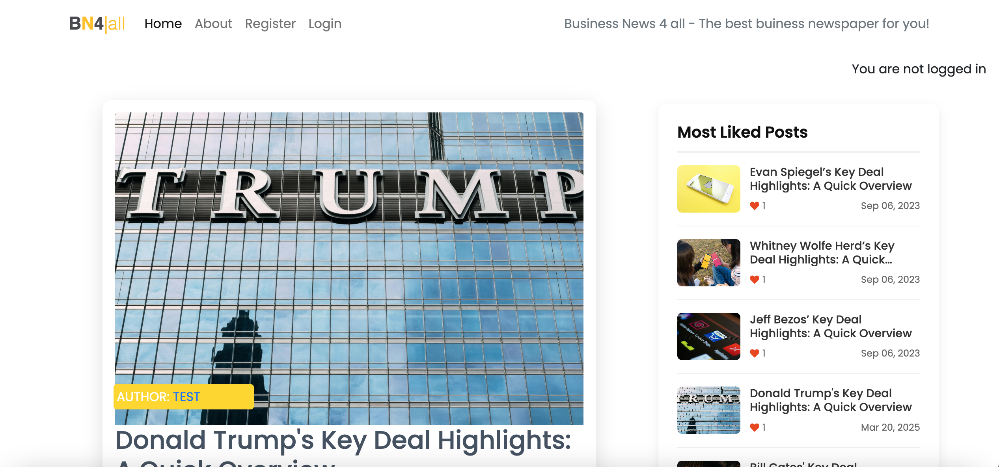

The idea behind this project was to create a business newspaper site which has a positive influnce amongs it's users. Very often when i read newspapers i see a combined way of reporting news with negative storys and positive storys. With Business News 4 all we aim to focus on positive storys only where the user can learn something new directly or indirectly through storys, events, people and many other examples. With this added value for the user for each post we aim to gain more revisits since our target market audience are entreprenuers who wants to expand their knowledge in entreprenuership and business.

# Features

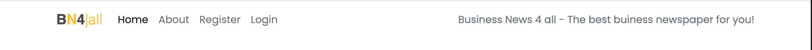

The navigation bar contains:

* A home page link button which is the BN4|all logo.

* An about page link button which takes the user to the about page where the user can see a bit more precisely on what areas we focus on in our news reporting and submit a form if they want to collaborate.

* A register link button if the user wants to sign up for an account.

* A login link button if the user wants to login to their existing account.

* On the right corner of the navigation bar the user will see a small text quote which says: Business News 4 all - The best buiness newspaper for you! This quote disappears for screens under 576px in the navbar.

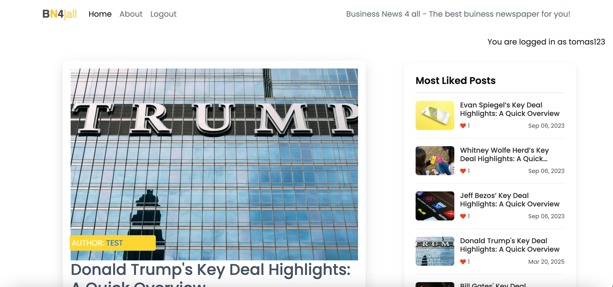

If the user is already logged in they will see:

* The home page link button which is the BN4|all logo.

* The about page link button which takes the user to the about page where the user can see a bit more precisely on what areas we focus on in our news reporting and submit a form if they want to collaborate.

* A logout link button which makes the user able to log out from the page.

* On the right corner of the navigation bar the user will see a small text quote which says: Business News 4 all - The best buiness newspaper for you! This quote disappears for screens under 576px in the navbar.

## News article posts outlook(Homepage)

The posts are shaped in a rectangular form similar to an "Ipad" wihout the sharp edges. Each post contains a picture in regards to the subject and a small rectangular yellow form with the title of the author who wrote the artice. The name of the author is a also a link which the user can click on to see more info about the author and other posts the author has uploaded.

Below the news post image the user can see a title about the post and a small description to catch their attention more. All this text is a clickable field and will convert the text to a yellow color when the mouse is hovered over it. When the user clicks on the text they will be forwarded into a new page which contains the full info about the news article post.

At the bottom of the post the user can see a timestamp of when the post was created and how many likes the post has achieved.

When the user scrolls down in the page then more and more news article posts will come up and the project has an infinity scroll so the user doesn't have to press any buttons to see more posts since they come up automatically.

In the top right corner there is a small text to tell the user if they are logged in or not.

## Deeper dive into the news article post

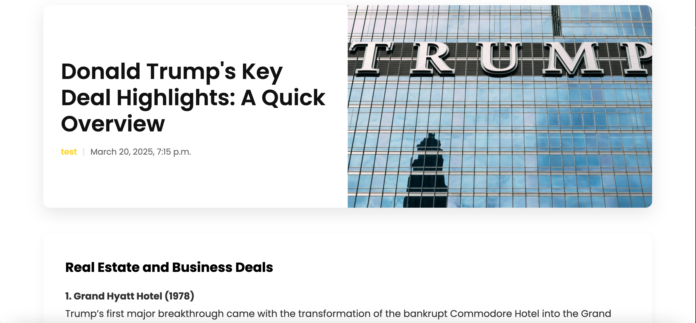

When the user has clicked on the news article they will be forwarded to a new page which is the full news article post. Inside the news article the user will see a big rectangular form which contains the the title, news article picture, timestamp of when the post was created and a link to the authors profile.

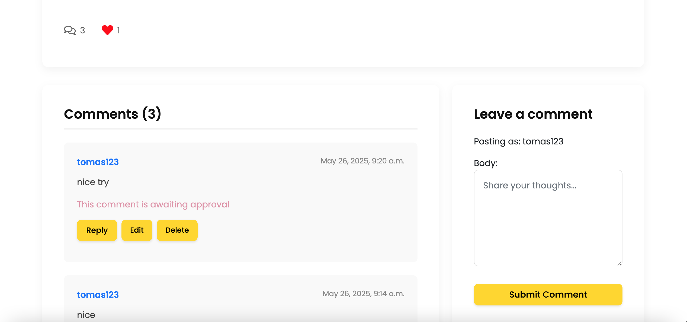

When the user scrolls down they will see the full news article text in regards to the subject. At the bottom of the page the user will be able to see how many likes the post has and comments that has been made by other users. If the user is logged in they will be able to like or comment on the post or reply to other comments that other users has done. The user also has the options of deleting or editing their comments based on if the comment is connected to their own account.

The user can also click on the others users profiles that has made comments and see more details about the users.

## User profiles

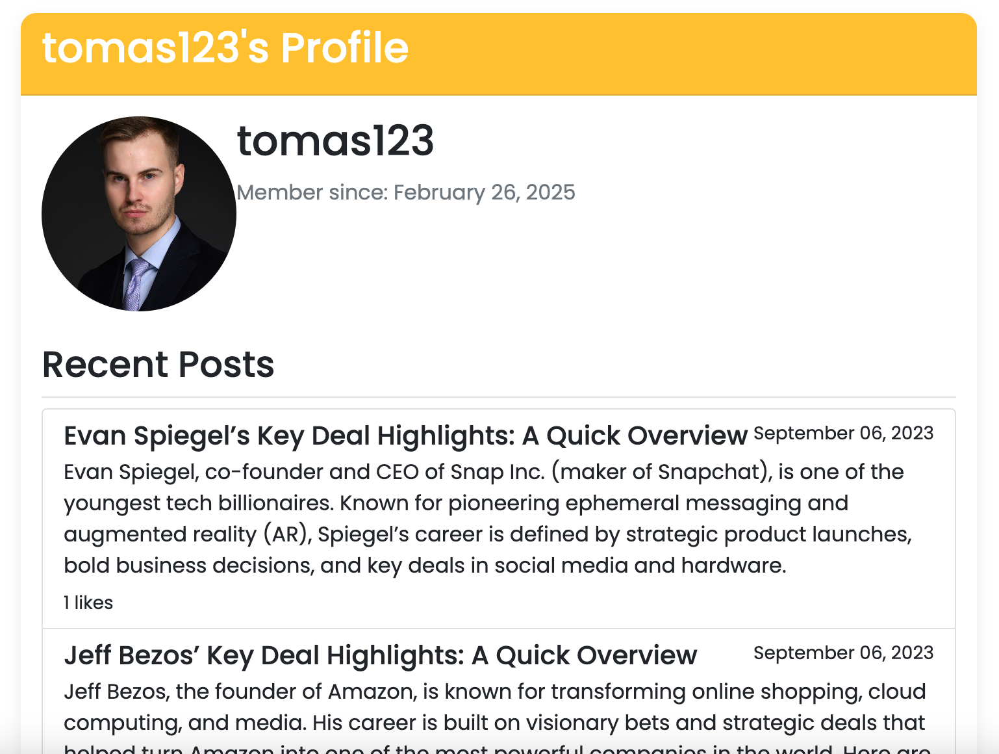

Each user who has registered an account is able to create their own user profile which is visable to the public if the user has commented on any of the news article posts. In the user profile the users are able to see the news article posts they have created, profile picture and a biography about the user profile.

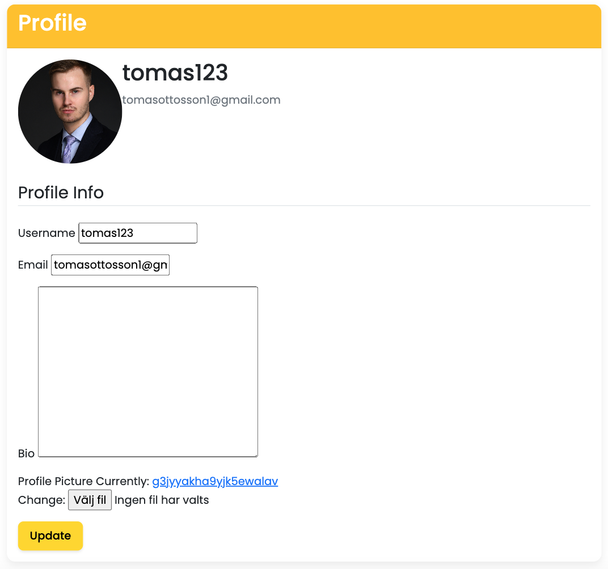

At the bottom of the page there is an edit button so the user can edit themselves on how they want their bigropahy to look like and also choose to upload a profile picture. The users will also be able to see when they became a member on the website aswell.

## Sidebar(Homepage)

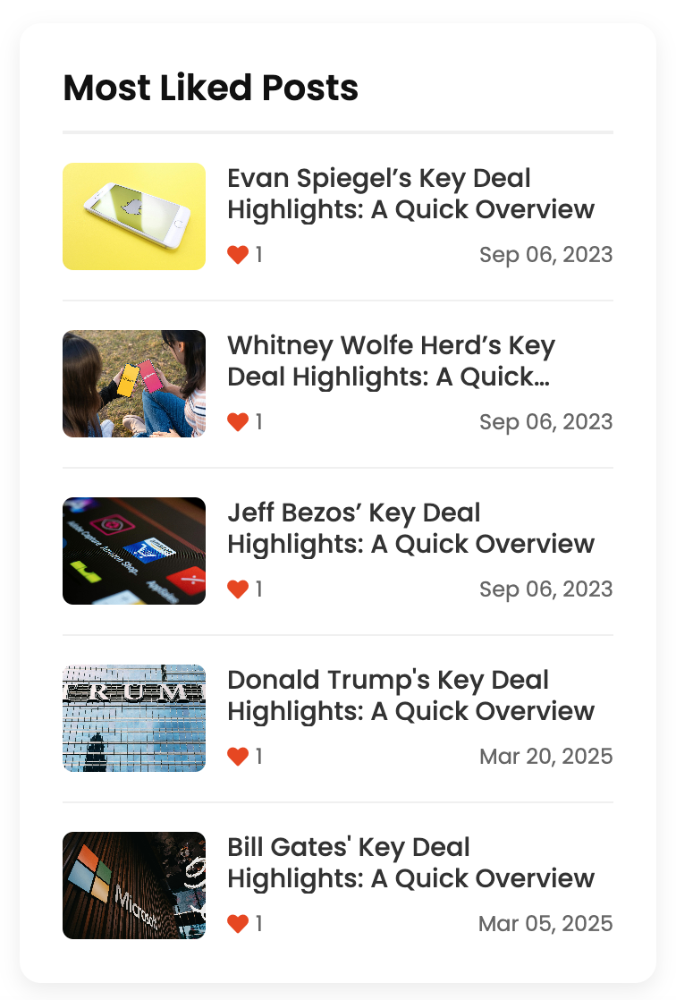

To the right side of the news article posts the user will see a sidebar where they can see the most liked posts. On a computer screen the sidebar will always follow the users scroll movements and still be stuck to the right side. In the sidebar the user can see five posts in total and timestamps of the posts. If the users clicks on any of these posts they will be forwarded to the full news article post. On a mobile screen the sidebar will only be visable at the bottom of the page since it would otherwise cover to much of the small screen sizes.

## Footer

The footer is visable on all pages and contains:

* Clickable icons of social medias such as: Facebook, Youtube, Twitter and Instagram.

* A text which says: Copyright 2025 Business News 4 all.

* A yellow background which is the bootstrap class: bg-warning.

## The About page

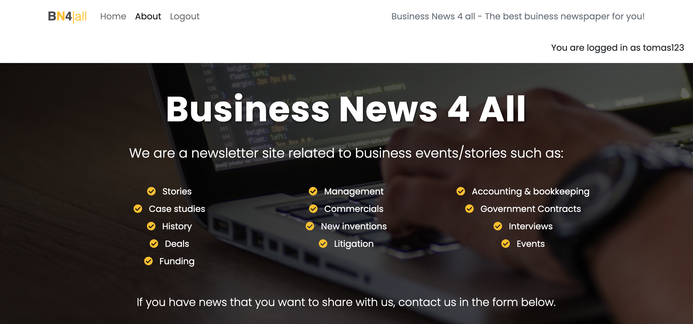

The first thing that happens when a user clicks on the about page in the navigation menu is that they will be forwarded to a new page. On the about page the user will see a big images of a computer screen with some bulletpoints of what ares the newspaper focuses on in their reporting.

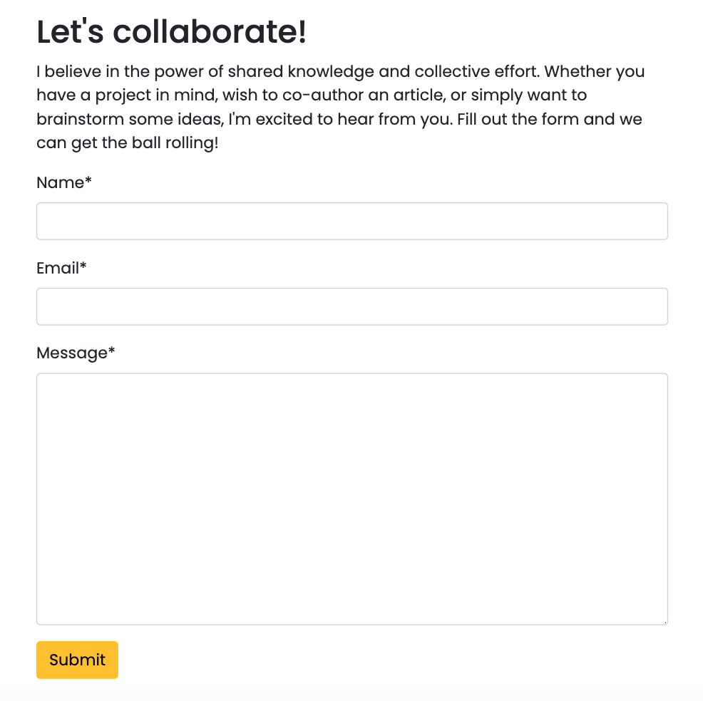

Under that the user will be able to fill in a form if the user is interested in a potenial collaboration. In that form the user needs to fill in name, email and a message where they explain their intention.

## The signup page

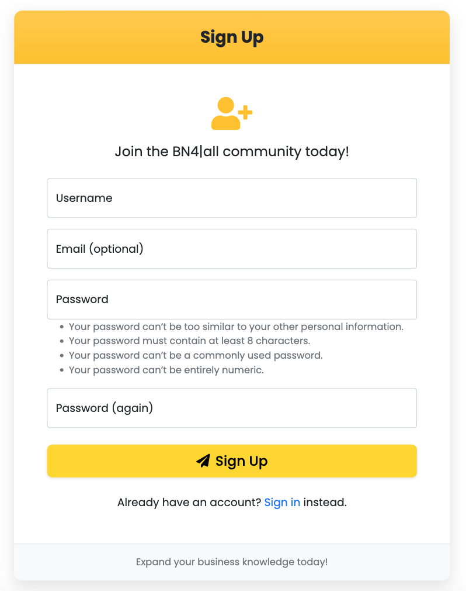

The sign up page contains a form four field where one is optional and the fields in the form consists of:

* Username

* Email(optional)

* Password

* Password(again)

Below the fields the user can press a sign up button and beneath the sign up button there is a text where the user can click on a link to the login page if the user already has an account registered. The form also has some rules which are the following in order to register an account: 

* Your password can’t be too similar to your other personal information.
* Your password must contain at least 8 characters.
* Your password can’t be a commonly used password.
* Your password can’t be entirely numeric.

## The login page

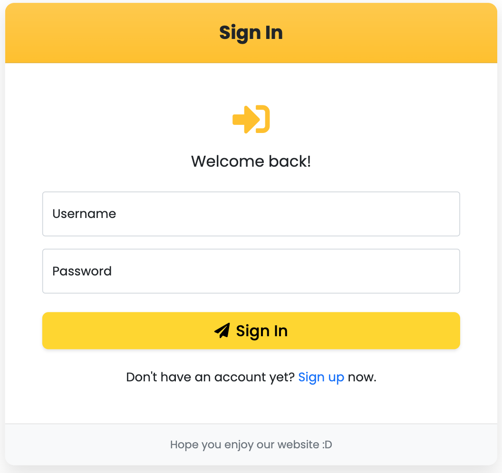

In the navigation menu when the user click on the login page link button they will be forwarded to a login form where they have to enter their username and password. The login form also has sign in button and beneath that there is a text where the user can press a link so they will be forwarded to the the sign up page if the user doesn't have an account already.

## The logout page

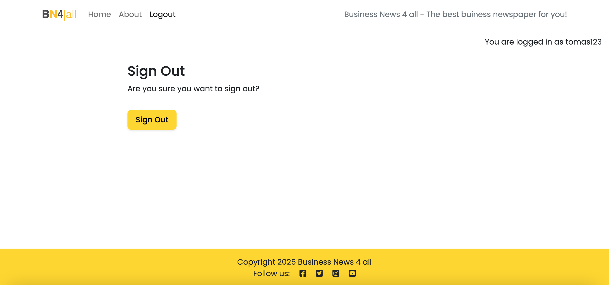

When the user is logged in a new alternative will come in the navigation which the logout link button. When the user clicks on that button the will be forwarded to the logout page which only consists of one simple signout button and a text which says: 

"Sign Out"
"Are you sure you want to sign out?".

This give the user a simple and clean solution to log out from the website.

## Manual Testing 

| Action                                      | Expectation                                              | Pass/Fail |
|---------------------------------------------|----------------------------------------------------------|-----------|
| Homepage links. | User is expected to be forwarded to the homepage. | Pass |
| About page links.               | User is expected to be forwarded to to the about page. | Pass |
| Signup/register page links. | User is expected to be forwarded to to the register page.  | Pass |
| Login page links. |  User is expected to be forwarded to the login page. | Pass |
| Logout page links. | User is expected to be forwarded to the logout page. | Pass |
| About form/Lets collaborate form. | User is expected to fill in name, email, message and sumbit the form through a button.   | Pass |
| Register page form | User is expected to fill in username, email(optional), password, password(again) and register through a button. | Pass |
| Login page form | User is expected to fill in their registered username, password and click on the login button. | Pass |
| Logout/signout page button | User is expected to be logged out from the page. | Pass |
| Homepage Infinity scroll | User is expected to see 6 news article post before the infinity scrolls loads up 6 more posts when they scroll down the page. | Pass |
| News article post links. | User is expected to be forwarded to the news full article blog posts when they click on the news article posts small text description about the news article. | Pass |
| User profile and author links. | User is expected to be forwarded to the user profile of the user or auther when they click on those related links/events.  | Pass |
| User profile edit button. | User is expected to be forwarded to a page where they can edit their profile. | Pass |
| User profile edit form. | User is expected to be able to edit their username, email, bio upload/change profile picture through textfields and buttons. | Pass |
| Like button. | User is expected to see the number of total likes of the post increse and add a red color. | Pass |
| Comment form on the news article posts. | User is expected to add a comment to the news article post through a textfield and button. After the comment process is done the comment will be awaiting an approval from an admin. | Pass |
| Reply to a comment button. | User is expected to see a new textfield come up under the choosed comment where they can either fulfill the reply or cancel the process through buttons. | Pass |
| Edit a comment button. | User is expected to a new textfield come up under the choosed comment of their own where they can edit the text. The new edited text will be awaiting an approval from the admin. | Pass |
| Delete comment button. | User is expected to see a pop up window come up which asks them another time if they are sure or not to the delete the comment. The user can choose to delete the comment or cancel the process through buttons. | Pass |
| Sidebar news article links/buttons. | User is expected to be forwarded to the full news article posts. | Pass |
| Footer social media link buttons. | User is expected to be forwarded to the related social media platform in a new tab. | Pass |
| Homepage news article posts text hover effect. | User is expected to see the small text description about the news articles turn into a yellowcolor. | Pass |
| Homepage news article posts and sidebar hover effects  | User is expected to see the news article posts either zoom in a bit or move. | Pass |
| Django Admin system | User admin is expected to be able to use django admin to adjust the relevant data. | Pass |

## More testing

* Pep8: https://pep8ci.herokuapp.com/

* CSS: https://jigsaw.w3.org/css-validator/#validate_by_input

* HTML: https://validator.w3.org/nu/

* Javascript: https://jshint.com/

## Project story.

I got inspired to create this project through a student project at Code Institute called "CodeStar Blog" where i learnt the basics of this project. Since i am very passionate about business/entrepreneurship and i really admired the "CodeStar Blog" project i wanted to combine my passion and the blog project with my sort of twist.

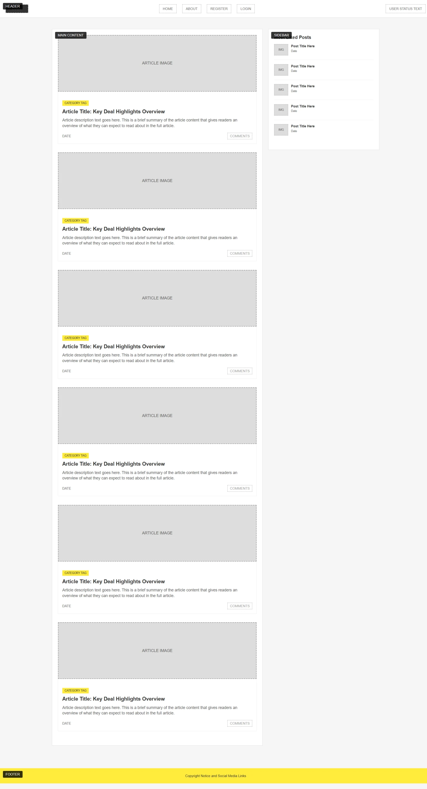

I first created a wireframe to get the visual experience of how it would potenially look like. After that i used my previous experience to build the blog. In this project i found it very hard to implement the infinity scroll function but eventually succeeded and i learnt many more new cool tools to use for example the sidebar, userprofiles etc.

## Deployment

* The deployment was made through github and Heroku. The step by step process where the following on github: Settings --> Pages --> Source --> Deploy from a branch --> Main --> /(root) --> Save.

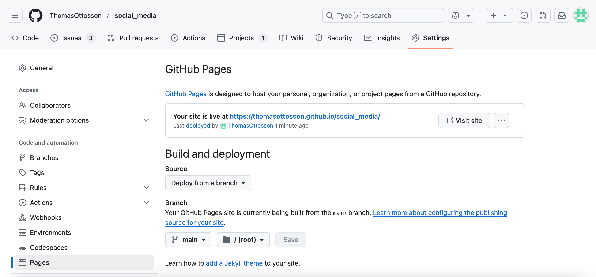

The depoyment though Heroku was made using the following steps: 

1. I clicked on the New button, then create app, choosed a unique name, picked Europe as a region and then pressed the button create app.

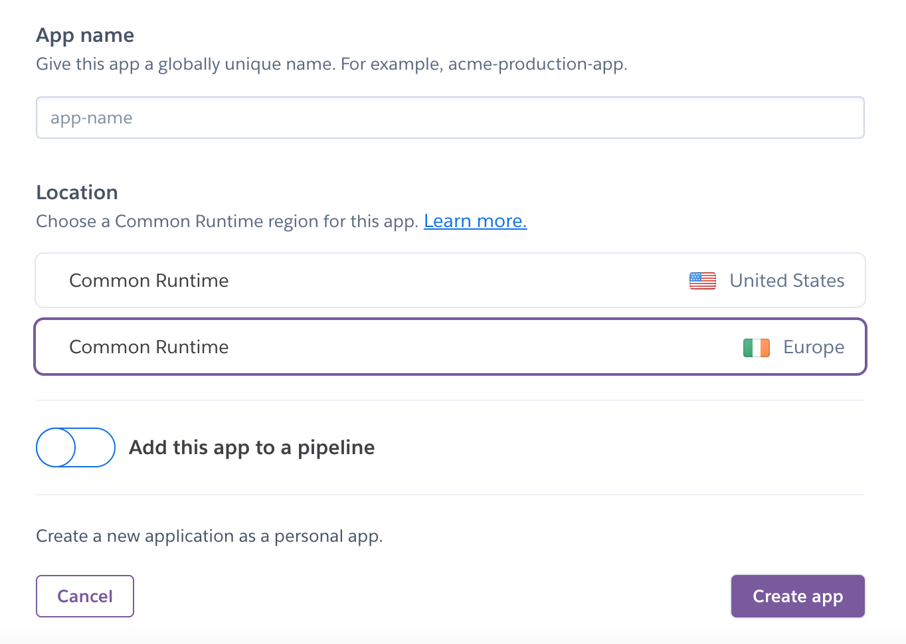

2. I clicked on the settings tab, scrolled down, added buildpacks for python first and node.js as the secondary buildpack and clicked save changes for each buildpack.

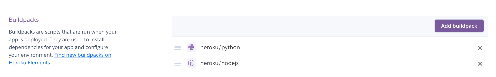

3. I clicked on the deploy tab, then pressed to connect with github, after that i searched for my repository and clicked on the connect button in order to link up the Heroku app with the repository code.

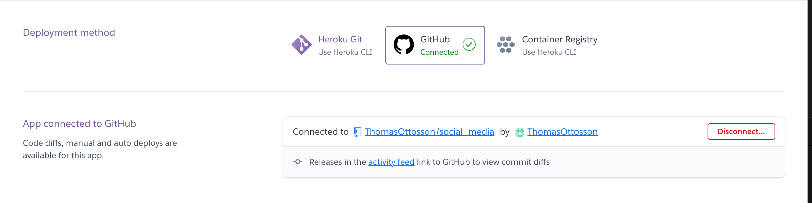

4. As a last step i scrolled down to the bottom of the deploy tab and pressed deploy branch which is a manually deployment process through Heroku.

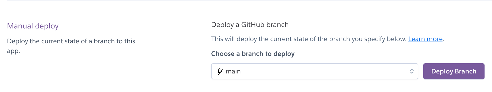

5. Additional point:

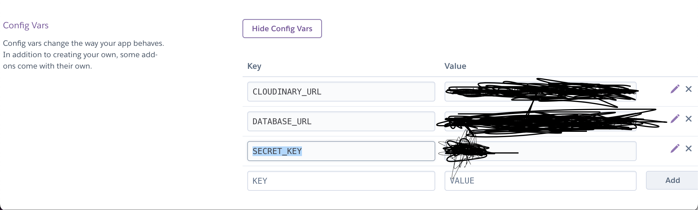

If a user wants to use this project and deploy it to Heroku then they need to add a key value par in the config var at heroku with the following keys:

* CLOUDINARY_URL

* DATABASE_URL

* SECRET_KEY

If a user wants to run the project locally then they should add the same keys and values to an env.py file in the root directory.

# Credits
* The majority of this code was inspired by Code Institute's love running project and CodeStar Blog. Here is a link to Code Institute's website: https://codeinstitute.net/
